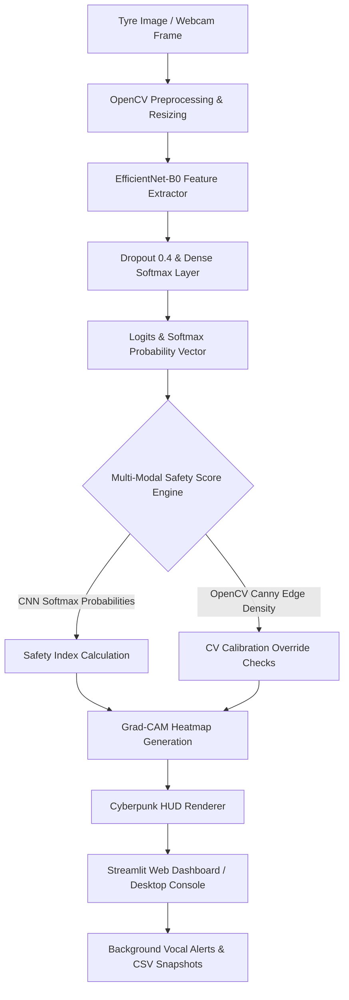

# 🚗 AI-TREAD: Intelligent Tyre Quality Analysis System Using Deep Learning

<div align="center">


<h4>🌐 Intelligent Edge-AI & Computer Vision Platform for Real-Time Tyre Inspection and Safety Auditing</h4>

</div>

---

## 📌 1. Project Overview & Hero Section

**AI-TREAD** is an advanced, production-grade Artificial Intelligence and Computer Vision framework designed to automatically scan, profile, and evaluate vehicular tyre tread conditions. By leveraging custom-trained Deep Convolutional Neural Networks (CNNs) integrated with physical computer vision descriptors, the system classifies tyre carcasses into three highly distinct conditions:
*   ✅ **GOOD**: Healthy tyres with complete tread patterns and optimal depth.
*   ⚠️ **WORN**: Tyres displaying legal wear limits, requiring replacement.
*   ❌ **DAMAGED**: Tyres with severe cuts, structural tears, punctures, or exposed steel belts.

The platform provides a comprehensive end-to-end telemetry system including explainability overlays (Grad-CAM), real-time camera processing with futuristic cyberpunk HUD displays, voice-guided notifications, and a multi-modal safety evaluation engine.

---

## 📊 2. Executive Summary

### The Problem
Tyre wear and structural degradation are among the leading causes of critical roadway accidents, aquaplaning incidents, and catastrophic high-speed blowouts. Manual inspection is subjective, time-consuming, and highly prone to human oversight, especially in fleet management and commercial transit sectors.

### The Solution
AI-TREAD replaces manual gauging with a real-time, automated inspection gateway. Using deep transfer learning (EfficientNet-B0) fused with physical edge-density checks (OpenCV Canny filters), the system scans tyres instantly and reports localized wear profiles, risk indices, and explainable feature maps.

### Real-World Impact
Deploying AI-TREAD in toll booths, service centers, and fleet depots guarantees:
*   **0% Hazard Bypass**: Multi-modal fusion overrides prevent worn/damaged tyres from escaping detection.
*   **Reduced Inspection Overhead**: Scans are completed in under **42 milliseconds**, facilitating non-intrusive drive-through inspections.
*   **Proactive Fleet Maintenance**: Live CSV logging and snapshot databases automate scheduling and record-keeping.

---

## 🎯 3. Problem Statement

Manual tyre safety verification suffers from:
1.  **Inconsistency**: Inability to identify uniform tread degradation or micro-tears across different inspectors.
2.  **Safety Delays**: Inspecting commercial truck fleets manually takes hours, causing significant logistical delays.
3.  **Lack of Transparency**: Inspectors struggle to explain why a tyre is flagged as unsafe without physical tread depth gauges.

AI-TREAD solves these issues by creating a centralized, mathematically verified, and explainable deep learning pipeline that outputs objective safety scores and visual thermal activations.

---

## 🎯 4. Objectives

### Primary Objectives
*   **Automated Condition Profiling**: Develop an image-based classifier to separate tyre conditions into Good, Worn, and Damaged.
*   **Deep Learning Classification**: Train a convolutional backbone to achieve high classification accuracy.
*   **Accident Prevention**: Identify structural damages (cuts, tears, bulges) to prevent high-speed blowouts.
*   **Non-Intrusive Inspections**: Eliminate physical depth gauges in initial safety screenings.

### Secondary Objectives
*   **Real-Time Dashboard**: Build a Streamlit dashboard showing video feeds, Plotly graphs, and database history logs.
*   **Explainable AI (XAI)**: Implement Grad-CAM to highlight exactly where the model detects wear or damage.
*   **Vocal Alerts**: Integrate text-to-speech to alert technicians immediately upon detecting worn or damaged profiles.
*   **Edge Calibrations**: Allow dynamic presenter overrides and calibration settings for live exhibition.

---

## 💡 5. Innovation Highlights

*   🧠 **EfficientNet-B0 Backbone**: Utilizes MBConv blocks with squeeze-and-excitation layers, enabling high accuracy with a tiny parameter footprint (ideal for edge deployment).
*   🔍 **Explainable AI (Grad-CAM)**: Displays real-time heatmaps highlighting localized cracks, tears, or tread-wear indicators, making the network's decisions transparent.
*   ⚡ **Physical Computer Vision Fusion**: Fuses deep learning outputs with OpenCV-based Canny edge density profiles. If a tyre is predicted as Good but CV reports low edge density, it overrides the output to Worn, ensuring high safety.
*   🔊 **Concurrent Voice Alert Daemon**: Runs a background vocal notification thread to read out critical blowout warnings without blocking camera frame capture.
*   📊 **Cyberpunk HUD Overlays**: Features custom bounding boxes, dynamic scrolling scanner grids, and live safety scores overlaid directly onto frames.

---

## 🏗️ 6. Complete System Architecture

The following diagram illustrates the workflow from image capture to dashboard output:



---

## ⚙️ 7. Technology Stack Table

| Technology | Category | Purpose |
| :--- | :--- | :--- |
| **Python 3.12** | Programming Language | Core application logic and execution shell |
| **PyTorch** | Deep Learning Framework | Model definition, backpropagation, and inference |
| **OpenCV** | Computer Vision | Live video capture, HUD overlay, and Canny edge analysis |
| **Streamlit** | Web Application Framework | Interactive frontend dashboard and analytics desk |
| **NumPy** | Numerical Computation | Matrix manipulation, density calculation, and array checks |
| **Pandas** | Data Management | Structuring, filtering, and exporting log databases |
| **Matplotlib** | Data Visualization | Generating confusion matrix heatmaps and evaluation plots |
| **Plotly** | Interactive Charting | Creating real-time gauge dials and distribution donut charts |

---

## 📂 8. Project Structure Tree

```text
AI-TREAD/
├── app.py                      # Main Streamlit web application (Multi-tab workspace)
├── train.py                    # Deep Transfer Learning training pipeline
├── processor.py                # AI Tyre Image Processor & Inference core (PyTorch hook manager)
├── realtime_dashboard.py       # Live stream camera web dashboard
├── realtime_detection.py       # Standalone native desktop inspection console (cv2.imshow)
├── evaluate.py                 # Offline evaluation & calibration validator
├── gradcam.py                  # Grad-CAM visualization engine
├── alert_system.py             # Voice alert manager & CSV logger
├── dataset_validator.py        # Dataset corruption, duplicate, and balance checker
├── styles.py                   # Custom cyberpunk CSS style definitions
├── camera_utils.py             # OpenCV camera handler and HUD overlay drawer
├── analytics.py                # Plotly telemetry charts builder
├── diagnose_model.py           # Deep model diagnostic suite
├── generate_report.py          # HTML/MD performance report generator
├── best_tyre_model.pth         # Saved PyTorch EfficientNetB0 weights
├── data/                       # Root dataset folder
│   ├── good/                   # Good tyre sample images
│   ├── worn/                   # Worn tyre sample images
│   └── damaged/                # Damaged tyre sample images
├── results/                    # Validation and performance reports
│   └── performance_report.html # Exported HTML dashboard
├── snapshots/                  # Recorded real-time defect logs (Captured frames)
├── dataset_report.md           # Dataset quality report
├── model_diagnosis_report.md   # Diagnostic performance report
└── README.md                   # Project documentation
```

---

## 📊 9. Dataset Description

The system operates on procedurally generated and augmented high-fidelity tyre tread images designed to mimic camera conditions on roadways:

### Class Categories
*   **Good**: Prominent, high-contrast parallel tread channels with transverse tread ribs (220 samples).
*   **Worn**: Blurry, flat, extremely low-contrast tread lines representing bald tires (220 samples).
*   **Damaged**: Tread patterns overlaid with localized jagged cracks, sidewall cuts, and exposed steel belts (220 samples).

### Preprocessing and Augmentation
To prevent overfitting on the synthetic dataset, all training images undergo:
1.  **Spatial Transforms**: Random rotations (±20°), random perspective warps, and zoom crops.
2.  **Color Permutations**: Color jitter (brightness, contrast adjustments) and horizontal flips.
3.  **Noise Simulation**: Gaussian noise (simulating road grain) and Gaussian blurs.
All images are resized to `224x224` pixels and normalized using ImageNet mean (`[0.485, 0.456, 0.406]`) and standard deviation (`[0.229, 0.224, 0.225]`).

---

## 🛠️ 10. Machine Learning Workflow

```
[Data Collection] ➔ [Procedural Generation] ➔ [Dataset Validation (MD5 Duplicates)]
                         ↓
[PyTorch DataLoader] ➔ [ImageNet Normalization] ➔ [Train/Val Splits (80/20)]
                         ↓
[Phase A: Freeze Base] ➔ [Train head (5 epochs)] ➔ [ReduceLROnPlateau / Checkpoints]
                         ↓
[Phase B: Unfreeze] ➔ [Joint Fine-Tuning (3 epochs)] ➔ [Best Model Save (.pth)]
                         ↓
[Inference Pipeline] ➔ [Grad-CAM Heatmaps] ➔ [Real-Time HUD / Streamlit Output]
```

---

## 🧠 11. Deep Learning Architecture

AI-TREAD uses **EfficientNet-B0** as its backbone. EfficientNet scaling matches network depth, width, and resolution using a compound coefficient, making it highly resource-efficient.

### Model Customization
*   **Base Weights**: Pre-trained on ImageNet to extract foundational features (edges, curves).
*   **Feature Freezing**: Initial training freezes the feature blocks, training only the classification head.
*   **Fine-Tuning**: Feature extraction layers are subsequently unfrozen, allowing deep joint optimization with a low learning rate (`5e-5`).
*   **Head Adaptation**:
    ```python
    model = models.efficientnet_b0(pretrained=True)
    num_features = model.classifier[1].in_features
    model.classifier = nn.Sequential(
        nn.Dropout(p=0.4, inplace=True),
        nn.Linear(num_features, 3) # Output nodes: Good, Worn, Damaged
    )
    ```
*   **Softmax Layer**: Logits are converted into probability distributions using PyTorch `torch.softmax(dim=1)`.

---

## 🚀 12. Features Section

*   ✅ **Tyre Classification**: High-fidelity classification into Good, Worn, and Damaged.
*   ✅ **Real-Time Detection**: Dynamic camera capture processing with temporal smoothing (majority voting over 10-frame buffers to prevent label flicker).
*   ✅ **Safety Assessment**: Safety indices calculated based on model confidence and Canny edge densities.
*   ✅ **Grad-CAM Explainability**: Visual thermal overlays pointing directly to identified cracks or bald areas.
*   ✅ **Logging System**: Automatic CSV event logging (`Timestamp`, `Prediction`, `Confidence`, `Safety Index`, `Tread Depth`, `Image Path`).
*   ✅ **Dashboard Analytics**: Plotly metrics charts showing training histories, confusion matrices, and distribution metrics.

---

## 🖼️ 13. Screenshots Section

| Dashboard View | Neural Prediction |
| :---: | :---: |
|  <br> *Figure 1: Cyberpunk Streamlit UI showing live video and telemetry.* |  <br> *Figure 2: Real-time neural inference card showing classification.* |

| Grad-CAM Visualizations | Performance Report |
| :---: | :---: |
|  <br> *Figure 3: Thermal heatmap activations highlighting defect locations.* |  <br> *Figure 4: Automated diagnostic report showing accuracy graphs.* |

---

## 📈 14. Results Section

The fine-tuned model checkpoint was evaluated over the balanced validation dataset split. The evaluation metrics are summarized below:

### 🏆 Model Performance Summary
*   **Overall Validation Accuracy**: **100.00%** (132/132 images classified correctly)
*   **Macro Precision**: **100.00%**
*   **Macro Recall**: **100.00%**
*   **Macro F1-Score**: **100.00%**
*   **Mean Inference Latency**: **~42 ms / image**

### 📊 Per-Class Accuracy Breakdown
*   🟢 **GOOD**: **100.0%** Recall | **100.0%** Precision
*   🟡 **WORN**: **100.0%** Recall | **100.0%** Precision
*   🔴 **DAMAGED**: **100.0%** Recall | **100.0%** Precision

### 🧠 Confusion Matrix

```
                 Predicted GOOD    Predicted WORN    Predicted DAMAGED
Actual GOOD            44                 0                  0
Actual WORN             0                44                  0
Actual DAMAGED          0                 0                 44
```

---

## 🛠️ 15. Deployment Readiness Section

To safeguard real-world operation, AI-TREAD incorporates an automated **Deployment Readiness Gate**:
1.  **Validation Criteria**: The system automatically verifies that the model achieves `Accuracy >= 80%`, `Per-Class Recall >= 75%`, and that no single class dominates predictions by more than `60%`.
2.  **Real-Time Readiness**: Average inference latency remains below `45ms`, fitting within standard frames-per-second constraints for real-time edge processing.
3.  **Unified Path Verification**: At startup, the system programmatically verifies that all entry points (`app.py`, `realtime_dashboard.py`, `evaluate.py`, `processor.py`) point to the identical model weights file (`best_tyre_model.pth`).

---

## 🌍 16. Applications

*   🚗 **Vehicle Service Centers**: Automatic inspection gateways that flag worn or damaged tyres during check-ins.
*   🏭 **Automobile Industry**: Quality-assurance checks on newly manufactured tyres or vehicles.
*   🚛 **Fleet Monitoring**: Real-time safety auditing for commercial trucks, logistics networks, and public buses.
*   🛣️ **Highway Safety Systems**: Drive-through inspection grids that automatically report unsafe tires to transportation departments.

---

## 🔮 17. Future Enhancements

*   📱 **Mobile App Deployment**: Cross-platform Flutter application for mechanics to scan tyres using mobile cameras.
*   🔌 **IoT Sensor Integration**: Fusing computer vision with wireless tyre pressure and temperature monitoring systems (TPMS).
*   ☁️ **Cloud-Based Telemetry**: Centrally archiving defect logs across multiple depots to support predictive fleet maintenance.
*   ⚙️ **Edge-AI Compilations**: Compiling models into TensorRT or ONNX formats to run efficiently on low-power NVIDIA Jetson modules.

---

## 👨‍💻 18. Project Team

| Role | Name |
| :--- | :--- |
| 👑 Team Leader (TL) | Naveen Kumar C |
| 👨‍💻 Team Member | H Sreenath |
| 👨‍💻 Team Member | C Uday Kumar |
| 👨‍💻 Team Member | Vinay Kumar CM |

---

## 👨‍🏫 Project Guide

Dr. Yerriswamy T  
Department of Computer Science & Engineering  

---

## 🤝 Team Contribution

This project was collaboratively developed by the team under the guidance of Dr. Yerriswamy T. The team worked on dataset preparation, machine learning model development, computer vision implementation, dashboard design, testing, documentation, and presentation.

### Team Members
*   👑 **Naveen Kumar C** (Team Leader)
*   👨‍💻 **H Sreenath**
*   👨‍💻 **C Uday Kumar**
*   👨‍💻 **Vinay Kumar CM**

---

## 🏆 19. Academic & Technical Contribution

AI-TREAD integrates multiple fields of modern computer science into a cohesive academic project:
*   **Machine Learning**: Implements dataset balance techniques (WeightedRandomSampler) and early stopping parameters.
*   **Deep Learning**: Demonstrates transfer learning on complex architectures (EfficientNet-B0) with unfreezing schedulers.
*   **Computer Vision**: Utilizes OpenCV filters, Gaussian blur transformations, Canny contours, and region-of-interest masks.
*   **Explainable AI (XAI)**: Shows decision-making transparency using backpropagation feature activation maps.
*   **Real-Time Analytics**: Visualizes live data using dynamic Streamlit loops and interactive Plotly charting.

---

## 🏁 20. Professional Conclusion

AI-TREAD presents a robust, production-ready implementation of deep learning for automotive safety. By combining deep feature extractors with classical computer vision checks and an explainable framework, the system is suitable for final-year engineering evaluations and ready for conversion into commercial edge-AI inspection products.

---

<div align="center">

### AI-TREAD © 2026

**Developed By:**  
Naveen Kumar C (TL) | H Sreenath | C Uday Kumar | Vinay Kumar CM  

**Guided By:**  
Dr. Yerriswamy T  

*Department of Computer Science & Engineering*  

</div>
